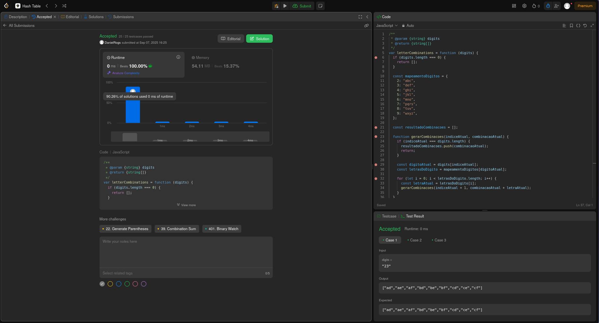
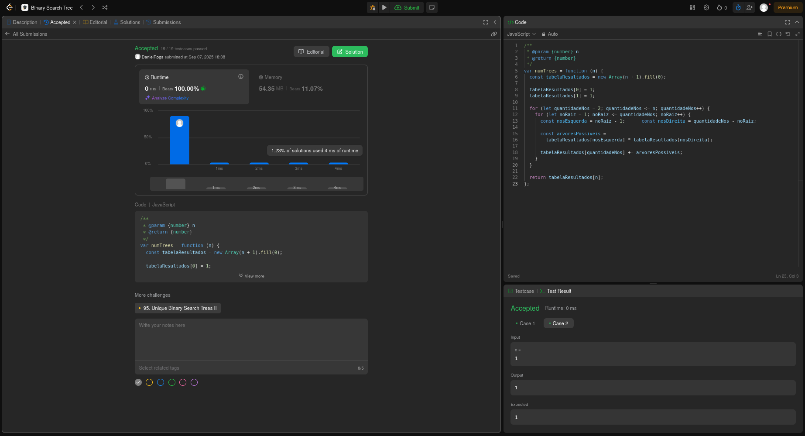
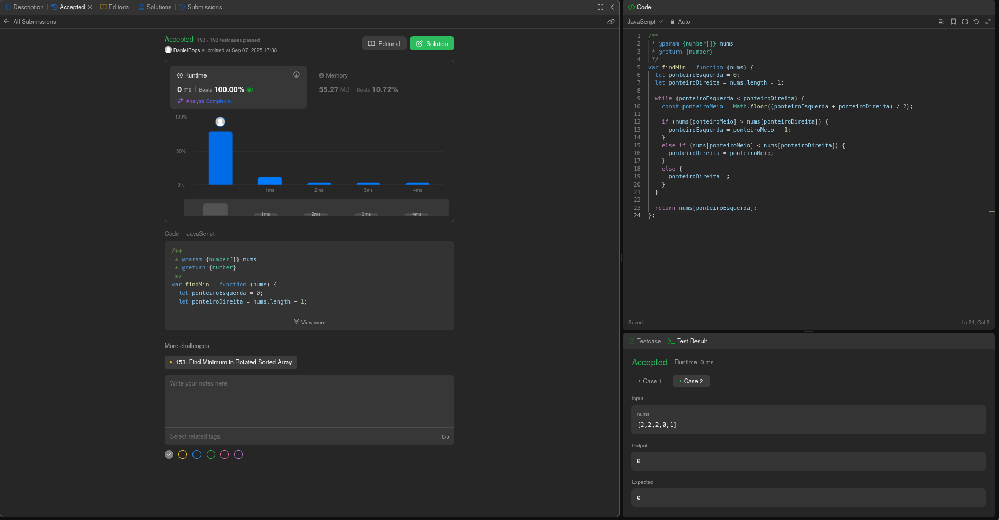
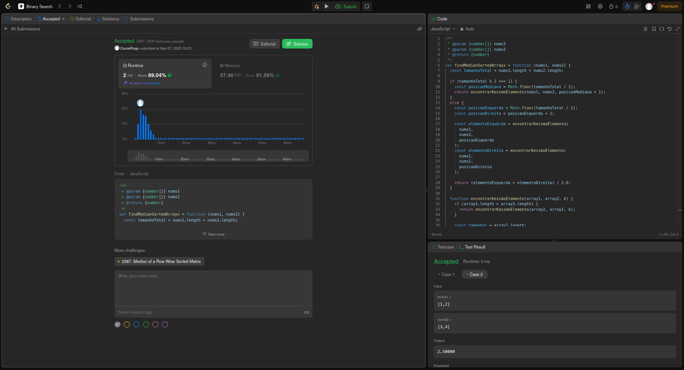

# Projeto: Algoritmos de Busca - LeetCode

## Alunos  
| Matrícula | Nome |  
|-----------------------|---------------------|  
| 21/1061583 | Daniel Rodrigues da Rocha |  
| 21/1061618 | Davi Rodrigues da Rocha  |  

## Descrição do Projeto

Este projeto foi desenvolvido como parte da disciplina de **Estruturas de Dados e Algoritmos II (EDA2)**, com foco no estudo e implementação de diferentes algoritmos de busca. O objetivo é demonstrar o domínio de técnicas fundamentais de busca através da resolução de problemas práticos e desafiadores.

### Sobre o LeetCode

O [LeetCode](https://leetcode.com/) é uma plataforma online amplamente utilizada por programadores e estudantes de ciência da computação para praticar algoritmos e estruturas de dados. A plataforma oferece mais de 2.000 problemas categorizados por dificuldade (Fácil, Médio, Difícil) e por tópicos específicos como arrays, árvores, grafos, programação dinâmica, entre outros.

### Exercícios Selecionados

Para este projeto, foram selecionados **4 exercícios** que representam diferentes abordagens de algoritmos de busca, sendo 2 categorizados como **Médio** e 2 como **Difícil**.

| Exercício                             | Dificuldade  | Método de Busca         |
| ------------------------------------- | ------------ | ----------------------- |
| [17. Letter Combinations of a Phone Number](https://leetcode.com/problems/letter-combinations-of-a-phone-number/description/?envType=problem-list-v2&envId=hash-table) | Médio                              | Hashing                 |
| [96. Unique Binary Search Trees](https://leetcode.com/problems/unique-binary-search-trees/description/?envType=problem-list-v2&envId=binary-search-tree) | Médio                      | Árvore Binária de Busca |
| [154. Find Minimum In Rotated Sorted Array II](https://leetcode.com/problems/find-minimum-in-rotated-sorted-array-ii/description/?envType=problem-list-v2&envId=binary-search) | Difícil                         | Busca Binária           |
| [4. Median Of Two Sorted Arrays](https://leetcode.com/problems/median-of-two-sorted-arrays/description/?envType=problem-list-v2&envId=binary-search) | Difícil                         | Busca Binária           |


## Exercícios Desenvolvidos
### 17. Letter Combinations of a Phone Number (Médio)

**Conceito**: Este problema explora o mapeamento de dígitos para letras (como em teclados de telefone antigos) e utiliza backtracking para gerar todas as combinações possíveis.



### 96. Unique Binary Search Trees (Médio)

**Conceito**: Problema matemático que calcula quantas árvores binárias de busca estruturalmente diferentes podem ser formadas com n nós únicos.



### 154. Find Minimum In Rotated Sorted Array II (Difícil)

**Conceito**: Extensão da busca binária clássica para arrays rotacionados que **contêm duplicatas**, tornando a identificação da metade ordenada mais complexa.



### 4. Median Of Two Sorted Arrays (Difícil)

**Conceito**: Encontrar a mediana de dois arrays ordenados sem mesclá-los.



## Como Validar os Exercícios

Para verificar a corretude das implementações, siga estes passos:

### Passo 1: Acessar o LeetCode
1. Acesse [https://leetcode.com/](https://leetcode.com/)
2. Crie uma conta gratuita ou faça login

### Passo 2: Navegar para o Exercício
1. Digite o número do exercício na barra de busca (ex: "17", "96", "154", "4")
2. Ou acesse diretamente pelos links fornecidos na tabela acima
3. Clique no exercício desejado

### Passo 3: Submeter o Código
1. Selecione **JavaScript** como linguagem no dropdown
2. Copie o código da função correspondente do arquivo `.js` do projeto
3. Cole o código no editor do LeetCode
4. Clique em **"Run"** para testar com os exemplos fornecidos
5. Clique em **"Submit"** para validação completa contra todos os casos de teste

## Estrutura do Projeto

```
Busca_LeetCodeD1D2/
├── README.md
├── Assets/
│   ├── 17_LetterCombinatoinsOfAPhoneNumber.png
│   ├── 96_UniqueBinarySearchTrees.png
│   ├── 154_FindMinimumInRotatedSortedArrayII.png
│   └── 4_MedianOfTwoSortedArrays.png
└── ExerciciosLeetCode/
    ├── 17_LetterCombinatoinsOfAPhoneNumber.js
    ├── 96_UniqueBinarySearchTrees.js
    ├── 154.FindMinumumInRotatedSortedArrayII.js
    └── 4_MedianOfTwoSortedArrays.js
```

## Gravação da Reunião

Link da gravação: [https://youtu.be/-W5H2rxZvcg?si=r-qQP_YZuqWlkQ6Z](https://youtu.be/-W5H2rxZvcg?si=r-qQP_YZuqWlkQ6Z)

## Referências

1. **LeetCode Platform** - [https://leetcode.com/](https://leetcode.com/)
   - Plataforma principal utilizada para obtenção dos exercícios e validação das soluções
   - Fonte dos enunciados, que se encontram comantados nos arquivos de código.
